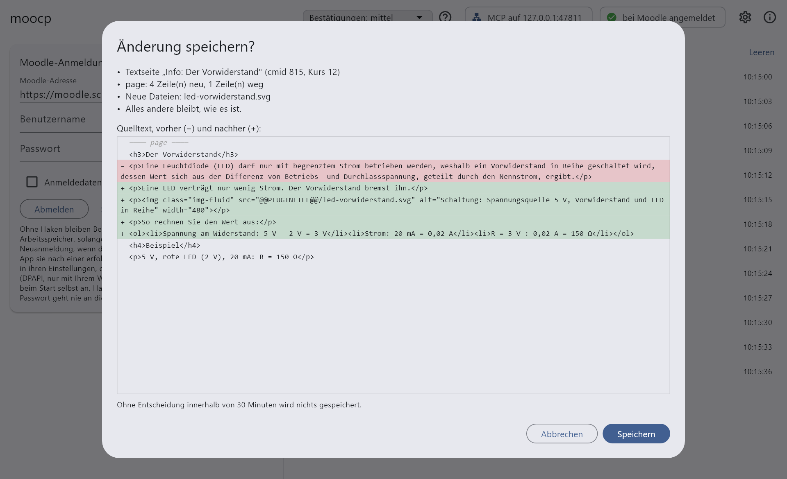
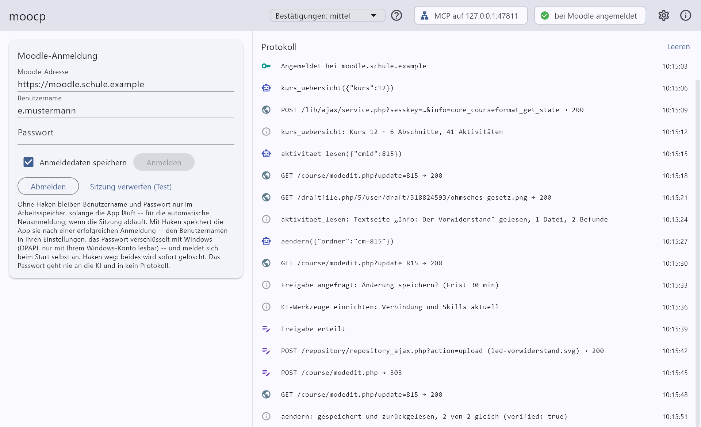

# moocp

Eine KI als Kollege im Moodle-Kurs – Claude, Codex oder ein Modell in LM Studio – über eine kleine Windows-App, die genau das an Moodle heranlässt, was für die Arbeit an Kursinhalten nötig ist, und sonst nichts. moocp arbeitet mit Moodle™.

> [!IMPORTANT]
> **Nutzung auf eigene Verantwortung.** moocp ist ein privates Open-Source-Projekt. Es wird weder von einer Schule, einem Land oder Schulträger noch von Moodle HQ, Anthropic, OpenAI oder LM Studio angeboten, geprüft oder unterstützt. Die Software kommt ohne Gewähr (siehe [Lizenz](LICENSE.md)); sie liest und ändert Ihre Moodle-Kurse, und Fehler sind nicht ausgeschlossen. Probieren Sie sie zuerst in einem Testkurs aus.
>
> **Vor dem Einsatz klären** – mit Schulleitung, Datenschutzbeauftragten und dem Betreiber Ihrer Moodle-Instanz:
>
> - ob Sie KI-Werkzeuge wie Claude, Codex oder LM Studio dienstlich einsetzen dürfen, und mit welchem Konto. Alles, was die KI liest, geht an den Anbieter des Modells, das im KI-Werkzeug eingestellt ist – bei Claude Code in der Regel Anthropic, bei Codex OpenAI. Auch LM Studio kann Cloud-Modelle benutzen; der Hinweis gilt deshalb für jedes KI-Werkzeug.
> - ob die Nutzungsbedingungen Ihrer Moodle-Instanz einen automatisierten Zugriff mit Ihrem Konto erlauben.
> - ob Inhalte Dritter in Ihren Kursen, etwa Verlagsmaterial, an eine KI gegeben werden dürfen; manche Lizenzen schließen das aus.
>
> Die Datensperre soll verhindern, dass personenbezogene Daten überhaupt angefragt werden. Gewährleistet ist das nicht: Ein Moodle-Update oder ein Zusatzmodul kann auf Seiten, die die App lesen darf, Personendaten zeigen, die dort vorher nicht standen. Namen und andere personenbezogene Daten, die im Kurstext selbst stehen, erkennt sie grundsätzlich nicht; sie können an die KI gelangen.

- [1. Quickstart](#1-quickstart)
- [2. Vorstellung](#2-vorstellung)
- [3. Benutzerhandbuch](#3-benutzerhandbuch)
- [4. Entwicklerhandbuch](#4-entwicklerhandbuch)

---

## 1. Quickstart

Der kürzeste Weg zum ersten Ergebnis; ausführlich steht alles im [Benutzerhandbuch](#3-benutzerhandbuch).

1. **Ein KI-Werkzeug installieren**: [Claude Desktop](https://claude.com/download) – anmelden und einmal den Reiter „Code" öffnen –, [Codex CLI](https://github.com/openai/codex) oder [LM Studio](https://lmstudio.ai).
2. **moocp installieren**: `moocp_setup_<Version>.exe` unter „Releases" dieses Repositorys herunterladen und ausführen; Windows 10 oder 11, Administratorrechte braucht es nicht. Beim ersten Mal warnt Windows, weil der Installer nicht signiert ist: „Weitere Informationen", dann „Trotzdem ausführen".
3. **KI-Werkzeuge einrichten**: Beim ersten Start fragt die App, ob sie nach Updates sehen darf, und zeigt dann den Dialog „KI-Werkzeuge einrichten" – dort „Installieren". Wer an einer berufsbildenden Schule unterrichtet, setzt vorher den Haken bei `lernsituation`.
4. **Bei Moodle anmelden**: Adresse, Benutzername und Passwort in die App eingeben. Oben rechts steht danach „bei Moodle angemeldet" und „MCP auf 127.0.0.1:…".
5. **Im KI-Werkzeug eine neue Sitzung starten** – eine, die vorher lief, kennt die App noch nicht – und loslegen, am besten in einem Testkurs. Sagen Sie einfach, was Sie brauchen, und kopieren Sie die Adresse aus der Adresszeile des Browsers dazu – Kurs, Abschnitt oder Seite, die KI liest heraus, was sie braucht:

   > Was steht alles in Abschnitt 2 von https://moodle.schule.example/course/view.php?id=12

   > Leg dort eine Textseite „Ohmsches Gesetz" an: kurze Erklärung, zwei Rechenbeispiele, drei Übungsaufgaben mit Lösungen.

   Die KI legt erst einen Plan vor und wartet auf Ihr Ja. Neu Angelegtes ist verborgen, bis Sie es sichtbar schalten; alles, was Bestehendes ändert, fragt vorher in der App nach Ihrer Freigabe. Wie oft gefragt wird, stellen Sie oben in der App ein („Bestätigungen", mit Hilfe hinter dem Fragezeichen).

Viel Spaß – und fangen Sie in einem Testkurs an, nicht im laufenden Kurs.

---

## 2. Vorstellung

### Worum es geht

moocp ist eine **schlanke, auf Moodle zugeschnittene Schnittstelle**
zwischen einem KI-Werkzeug und Ihren Moodle-Kursen. Statt die KI durch die
Moodle-Oberfläche klicken zu lassen, bietet die App Werkzeuge an: Kurs
überblicken, eine Aktivität vollständig lesen, anlegen, ändern, verschieben,
duplizieren, sichtbar schalten, löschen, Fragen importieren, Tests zusammenstellen. Jedes
Werkzeug tut genau eine Sache, liest das Ergebnis aus Moodle zurück und sagt,
ob es wirklich angekommen ist.

Weil **jede** Anfrage an Moodle durch die App geht, ist sie zugleich eine
**Datensperre**: Seiten und Dateien mit personenbezogenen Daten – Noten,
Abgaben, Testversuche, Profile, Teilnehmendenlisten – fragt sie gar nicht erst
an. Was nicht angefragt wird, kann auch nicht bei einer KI landen. Diese
Sperre steht im Programmcode, nicht in einer Bitte an die KI, und soll sich
so weit ausbauen lassen, dass sie sich DSGVO-seitig begründen lässt.

Das fachliche Wissen – wie Testfragen Können prüfen statt Auswendiggelerntes, wie Quellen angegeben werden, wie ein Blatt auch auf Papier taugt – steckt in **Skills**, die das KI-Werkzeug dazu lädt: `moodle` für Kurse und `moodle-fragen` für Fragen und Tests. Für berufsbildende Schulen gibt es zusätzlich `lernsituation`: Lernsituationen mit SchuCu-Tabelle, Lehrerhandreichung, Arbeits- und Informationsblättern entwerfen – dazu Board, Wiki, Test und was sonst zum Ablauf passt – und in den Kurs bringen. Wer ihn braucht, setzt beim Einrichten einen Haken.

### Was die KI damit tun kann

- **Kurse überblicken**: Abschnitte, Unterabschnitte und Aktivitäten mit
  Sichtbarkeit – mit Warnung, wenn etwas für Lernende erreichbar ist, das nach
  Lösung oder Lehrermaterial klingt.
- **Aktivitäten vollständig lesen** – Text, Bilder, Anhänge, Dateien eines
  Verzeichnisses, alle Einstellungen – und dazu eine Übersicht bekommen:
  Gliederung, Bilder mit Alternativtext, Verweise mit dem Titel des Ziels und
  Hinweise auf typische Schwächen (fehlender Alternativtext, „hier"-Links,
  Bilder von fremden Servern, Word-Reste, leere Absätze …).
- **Anlegen und überarbeiten**: Abschnitte und die Aktivitäten aus der [Übersicht unten](#unterstützte-aktivitäten-und-fragetypen) – mit Bildern, selbst gezeichneten Skizzen, Anhängen, Fristen und Punkten. Neues ist erst einmal verborgen. Vor dem Überarbeiten fragt die KI, ob direkt geändert oder an einer Kopie gearbeitet werden soll; eine Kopie kommt ohne Verweise auf das Original aus, das bleibt, bis Sie es löschen.
- **Vorhandene Arbeits- und Informationsblätter übernehmen** (PDF, ODT,
  DOCX): Übernommen wird, was etwas bedeutet – Überschrift, Merkkasten,
  Tabelle –, nicht, wie es aussah. Danach sieht das Blatt aus wie jede
  andere Seite im Kurs, am Bildschirm wie im Ausdruck. Hat Ihre Moodle-Instanz die Druckaufbereitung „Aufgabenblatt-Druck", erkennt die App sie beim Anmelden, und Blätter zum Ausdrucken bekommen Karofelder zum Ausfüllen, auf Wunsch Schreiblinien.
- **Formeln** schreiben, die Moodle mit MathJax setzt – am Bildschirm wie im Ausdruck, auch Chemie. Vorher sieht die App in den Filtereinstellungen des Kurses nach, ob er Formeln setzt, und sagt sonst, wo Sie MathJax einschalten.
- **Bewertungsraster** (Rubrik, Bewertungsrichtlinie) einer Aufgabe festlegen, samt Optionen – etwa ob Lernende das Raster schon vor der Bewertung sehen.
- **Fragen anlegen und ändern**, auch STACK-Fragen mit Rückmeldebaum und CodeRunner-Programmieraufgaben – die App prüft sie danach selbst. STACK-Fragen bekommen auf Wunsch Zeichnungen (JSXGraph), die mit den Zufallswerten mitgehen, oder in denen die Lernenden einen Punkt an die richtige Stelle ziehen.
- **Tests zusammenstellen**: Fragen und Zufallsfragen einfügen, Punkte,
  Reihenfolge, Seiten, Fragen mischen, Beste Bewertung angleichen.
- **Verschieben, sichtbar schalten, löschen.**
- **Vorschlagen, was sich wofür anbietet**: neben Textseite und Aufgabe auch Board, Kanban-Board, Wiki, Fortschrittsliste oder ein Übungstest – am Gerät, auf Papier oder gemischt, etwa ein Schritt im Computerraum in einem Kurs, der sonst auf Papier läuft, oder ein Blatt, das die Lernenden abfotografieren und in der Aufgabe abgeben. Entscheiden tun Sie.
- **Selbst nachsehen**: Die KI kann sich ansehen, wie eine Textseite, ein Buchkapitel, eine Wikiseite oder eine Frage im Browser aussieht – ob die Formeln gesetzt sind, wie ein Blatt im Ausdruck umbricht, ob eine Frage in der Vorschau läuft. Jedes Bild sehen Sie zuerst, zusammen mit dem Grund, warum die KI es braucht.

### Unterstützte Aktivitäten und Fragetypen

Die Aktivitäten in dieser Tabelle kann die KI lesen, anlegen und ändern – Text, Bilder, Anhänge und Einstellungen –, dazu verschieben, duplizieren, sichtbar schalten und löschen. Was darüber hinaus geht, steht in der rechten Spalte. Ein Stern markiert ein Zusatzmodul: Damit geht es nur, wo Ihre Moodle-Instanz es installiert hat.

| Aktivität | Moodle | darüber hinaus |
|---|---|---|
| Textseite | `page` | |
| Textfeld | `label` | |
| Aufgabe | `assign` | Bewertungsraster (Rubrik, Bewertungsrichtlinie) festlegen |
| Verzeichnis | `folder` | Dateien hinzufügen, ersetzen, entfernen |
| Datei | `resource` | |
| Link | `url` | |
| Unterabschnitt | `subsection` | mit allem, was darin liegt, sichtbar schalten |
| Buch | `book` | Kapitel anlegen, ändern, verschieben, löschen |
| Test | `quiz` | Fragen und Zufallsfragen einfügen; Punkte, Reihenfolge, Seiten, Fragen mischen, Beste Bewertung |
| Fragensammlung | `qbank` | Kategorien anlegen; Fragen siehe unten. Moodle legt sie immer im allgemeinen Abschnitt an; verbergen, verschieben und duplizieren gehen bei ihr nicht |
| Fortschrittsliste\* | `checklist` | Einträge anlegen, ändern, ordnen, einrücken, löschen |
| Wiki | `wiki` | Seiten schreiben und löschen – nur gemeinsame Wikis ohne Gruppenmodus |
| Board\* | `board` | Spalten und eigene Notizen – nicht im Einzelnutzermodus |
| Kanban-Board\* | `kanban` | Spalten und Karten des gemeinsamen Boards – keine persönlichen Boards |

Alle anderen Aktivitäten – Forum, Glossar, H5P und weitere – kann die KI lesen (Beschreibung und Einstellungen), verschieben, duplizieren, sichtbar schalten und löschen, aber nicht anlegen oder ändern. Abschnitte kann die KI anlegen, umbenennen, mit einer Beschreibung versehen, verschieben, sichtbar schalten und löschen.

**Fragetypen**, auch mit Bildern und Zeichnungen:

- **Anlegen und ändern, Kerntypen von Moodle:** Multiple Choice (`multichoice`), Wahr/Falsch (`truefalse`), Kurzantwort (`shortanswer`), Numerisch (`numerical`), Zuordnung (`match`), Freitext (`essay`), Beschreibung (`description`), Lückentext/Cloze (`multianswer`), Lückentextauswahl (`gapselect`), Drag-and-Drop auf Text (`ddwtos`), Berechnet (`calculated`), Einfach berechnet (`calculatedsimple`), Berechnete Multiple-Choice (`calculatedmulti`), Zufällige Kurzantwortzuordnung (`randomsamatch`), Anordnung (`ordering`).
- **Anlegen und ändern, Zusatzmodule\*:** STACK (`stack`) mit Rückmeldebaum, Fragetests und Zeichnungen (JSXGraph, in der Version, die STACK mitbringt), CodeRunner (`coderunner`), Drag-and-Drop-Zuordnung (`ddmatch`), Mehrfach Wahr/Falsch (`mtf`), Erweiterter Lückentext (`gapfill`).
- **Nur lesen:** Drag-and-Drop auf Bild (`ddimageortext`) und Drag-and-Drop-Markierungen (`ddmarker`) – sie brauchen ein Hintergrundbild mit Pixelkoordinaten – sowie alle übrigen Zusatztypen.

### Sie behalten die Kontrolle

Bevor die App Bestehendes ändert, verschiebt, sichtbar schaltet oder löscht,
zeigt sie Ihnen, was geschieht – bei Änderungen Zeile für Zeile. Gespeichert
wird erst nach Ihrem Klick. Ebenso bei jedem Bildschirmfoto: Sie sehen das
Bild und den Grund, und erst nach Ihrem Klick geht es an die KI.

Wie oft gefragt wird, entscheiden Sie: Das Feld „Bestätigungen" oben im Fenster hat drei Stufen – **alle** (vor jedem Schreibvorgang, auch vor verborgen Angelegtem), **mittel** (die Voreinstellung: vor allem, was Bestehendes anfasst oder sofort sichtbar wird) und **keine** (gar keine Rückfrage; dann ist das Feld rot). Was die Stufen genau bedeuten, sagt die Hilfe hinter dem Fragezeichen daneben.



Im Hauptfenster sehen Sie jederzeit, was die KI angefragt hat und was die App
dafür bei Moodle getan hat.



*Beide Bilder zeigen erfundene Daten.*

Welche Werkzeuge die KI hat und welche davon Ihre Freigabe brauchen, steht im Benutzerhandbuch unter [Die Werkzeuge](#die-werkzeuge-was-die-ki-tun-kann); was die App nie anfragt, unter [Sperrliste und Positivliste](#sperrliste-und-positivliste-was-die-app-anfragen-darf).

### Was die App nie tun soll

- Noten, Abgaben, Testversuche, Profile oder Protokolle von Lernenden lesen.
- Ihr Passwort an die KI geben oder in ein Protokoll schreiben.
- Beliebige Adressen aufrufen oder beliebigen Code ausführen – es gibt nur
  ihre Werkzeuge.
- Ohne Ihr Ja einen anderen Rechner als Ihr Moodle anfragen. Die einzige
  Ausnahme ist die Suche nach Updates, und die fragt Sie beim ersten Start.
- Bestehendes ändern, verschieben, sichtbar schalten oder löschen, ohne dass
  Sie zustimmen.
- Fragen löschen, ohne dass Sie zustimmen – und dann mit allen Versionen, nie nur eine.

### Voraussetzungen

- Windows 10 oder 11
- Eines dieser KI-Werkzeuge auf demselben Rechner:
  - [Claude Code](https://claude.com/claude-code), am einfachsten als Claude-Desktop-App mit dem Reiter „Code";
  - [Codex CLI](https://github.com/openai/codex) von OpenAI, ab Version 0.77;
  - [LM Studio](https://lmstudio.ai) mit seinem Agenten Bionic (eigenes Programm, einmal gestartet), mit einem lokalen oder einem Cloud-Modell. Das Modell muss mit vielen Werkzeugen und langen Anleitungen zurechtkommen; kleine lokale Modelle tun das oft nicht.

  Claude im Browser (claude.ai) und ChatGPT – im Browser wie als App – erreichen die App auf Ihrem Rechner nicht: Ihre Werkzeuge laufen über die Server des Anbieters. Ollama allein bietet keinen Anschluss für Werkzeuge.
- Ein Moodle-Konto mit Bearbeitungsrechten im Kurs, Anmeldung mit
  Benutzername und Passwort. Erprobt mit Moodle 5.1.
- Nur mit dem Skill `lernsituation`: Python 3, damit er seine Ausarbeitungen selbst prüfen kann; ohne Python läuft alles andere.

### Lizenz und Marken

moocp steht unter der [MIT-Lizenz](LICENSE.md): Sie dürfen die App frei benutzen, weitergeben und verändern. Die Lizenzen aller eingebundenen Pakete zeigt die App über ⓘ oben rechts, „Lizenzen ansehen". Was sich von Version zu Version ändert, steht in [CHANGELOG.md](CHANGELOG.md).

Moodle™ ist eine eingetragene Marke von Moodle Pty Ltd, Claude eine Marke von Anthropic PBC; Codex, ChatGPT und LM Studio sind Marken ihrer jeweiligen Inhaber. moocp ist ein unabhängiges Projekt und mit keinem von ihnen verbunden.

---

## 3. Benutzerhandbuch

### Installation

1. **Installieren.** Den Installer `moocp_setup_<Version>.exe` ausführen, zu finden unter „Releases" dieses Repositorys; selbst bauen geht auch, siehe Entwicklerhandbuch. Es gibt einen Installer für alle Schulen, welche Skills dazukommen, wählen Sie in Schritt 2. Administratorrechte braucht er nicht: Die App kommt nach `%LOCALAPPDATA%\Programs\moocp`, mit Verknüpfungen im Startmenü und auf dem Desktop. Weil der Installer nicht signiert ist, warnt Windows beim ersten Mal („Der Computer wurde durch Windows geschützt"); „Weitere Informationen", dann „Trotzdem ausführen". Seine erste Seite ist der Hinweis zur Nutzung vom Anfang dieser Seite; „Weiter" wird dort nach zehn Sekunden aktiv, damit er nicht weggeklickt wird, bevor jemand ihn gelesen hat. Eine neue Version wird genauso installiert; Einstellungen und gespeicherte Anmeldedaten bleiben. Auf Wunsch sucht die App selbst nach neuen Versionen, siehe [Updates](#updates).
2. **KI-Werkzeuge einrichten.** Beim Start sucht die App nach Claude Code, Codex CLI und LM Studio und prüft für jedes gefundene, ob es die App kennt und ob ihre Skills in dem Stand installiert sind, der zu dieser App gehört. Passt etwas nicht, erscheint der Dialog „KI-Werkzeuge einrichten": je Werkzeug ein Haken, darunter eine Zeile für die Verbindung und eine für die Skills, zum Schluss die wählbaren Skills. Eingerichtet wird jedes gefundene Werkzeug mit Haken – voreingestellt alle, eines genügt. Ohne Haken entfernt „Installieren" dort Verbindung und Skills, und die Wahl bleibt; ein Werkzeug, das Sie später installieren, bietet der Dialog beim nächsten Start von selbst an. `moodle` und `moodle-fragen` sind immer dabei; `lernsituation` ist für berufsbildende Schulen und kommt nur mit Haken dazu. „Installieren" richtet alles ein, was fehlt, und entfernt Abgewähltes wieder. Später öffnet „Verbindung und Skills prüfen" in den Einstellungen (Zahnrad oben rechts) denselben Dialog, etwa um `lernsituation` oder ein weiteres Werkzeug dazuzunehmen. Schlägt dabei etwas fehl, steht es in der Zeile, und „Nochmal versuchen" versucht es erneut. Überspringen lässt sich die Einrichtung nicht, denn ohne ein eingerichtetes Werkzeug kann niemand mit der App arbeiten: „Beenden" schließt die App, und beim nächsten Start fragt sie wieder. Nach dem Installieren im KI-Werkzeug eine **neue Sitzung** starten – eine laufende sieht die Änderungen nicht.

   Was die App wo einträgt:

   - **Claude Code**: die Verbindung über dessen Kommandozeile, die Skills nach `%USERPROFILE%\.claude\skills`. Bei Claude Desktop liegt Claude Code erst auf dem Rechner, wenn der Bereich „Code" einmal geöffnet wurde. Die App findet es selbst, auch dort, wo Windows es bei der Store-Version hinlegt (`%LOCALAPPDATA%\Packages\Claude_…\LocalCache\Roaming\Claude\claude-code\` – der Pfad `%APPDATA%\Claude\…`, den Claude Desktop selbst anzeigt, ist für andere Programme umgeleitet). Findet sie es nicht, sagt der Dialog es; nach der Installation von Claude Desktop genügt „Nochmal prüfen".
   - **Codex CLI**: den Abschnitt `[mcp_servers.moodle]` in `%USERPROFILE%\.codex\config.toml` – alles andere darin bleibt, wie es ist –, die Skills nach `%USERPROFILE%\.codex\skills`.
   - **LM Studio (Bionic)**: den Server `moodle` in Bionics Liste der MCP-Server (`%USERPROFILE%\.lmstudio\apps\bionic\.internal\ng-mcp.json`) – andere Einträge bleiben –, die Skills nach `%USERPROFILE%\.lmstudio\skills`. Eingetragen ist die kleine Brücke `moocp-bruecke.exe` aus dem Programmordner, denn Bionic startet Server nur als lokales Programm.
3. **Bei Moodle anmelden.** Nach dem Einrichten in der App Moodle-Adresse, Benutzername und Passwort eingeben, „Anmelden". Oben rechts steht dann „bei Moodle angemeldet" und daneben „MCP auf 127.0.0.1:…": Erst jetzt nimmt die App Anfragen der KI an, damit schon die erste alles bereit findet. Eine Sitzung, die vorher gestartet wurde, findet die App nicht: dort mit `/mcp` neu verbinden oder eine neue Sitzung starten; Bionic verbindet sich von selbst.

### Einrichten

Links im Hauptfenster melden Sie sich bei Moodle an. Mit Haken „Anmeldedaten speichern" merkt sich die App Benutzername und Passwort nach einer erfolgreichen Anmeldung (das Passwort mit Windows verschlüsselt, siehe unten) und meldet sich beim nächsten Start selbst an. Ohne Haken melden Sie sich nach jedem Start neu an. Welche KI-Werkzeuge eingerichtet und welche Skills installiert sind, wählen Sie im Dialog „KI-Werkzeuge einrichten"; ihn und die Suche nach Updates finden Sie unter dem Zahnrad oben rechts. Weitere Einstellungen gibt es nicht.

Die App darf in jedem Kurs, in dem Ihr Konto Bearbeitungsrechte hat, genau
das, was Sie dort dürfen. Damit nicht versehentlich der falsche Kurs oder das
falsche Objekt getroffen wird, nennt jede Freigabe Kurs und Namen, und
Werkzeuge, die Bestehendes verschieben, verbergen oder löschen, brechen ab,
wenn Nummer und Name nicht zusammenpassen.

### Claude Code, Codex CLI und LM Studio

In allen dreien arbeiten Sie gleich, siehe [Arbeiten](#arbeiten); die Skills nimmt die KI von selbst. Was je Werkzeug anders ist:

- **Claude Code**: in der Claude-Desktop-App im Reiter „Code" eine neue Sitzung beginnen. `/mcp` zeigt die Verbindung; `/moodle`, `/moodle-fragen` oder `/lernsituation` ruft einen Skill gezielt auf.
- **Codex CLI**: in einer Eingabeaufforderung `codex` starten. `/mcp` zeigt die Verbindung; `$moodle`, `$moodle-fragen` oder `$lernsituation` in der Anfrage wählt einen Skill gezielt.
- **LM Studio**: Bionic starten, nicht das klassische LM Studio, und ein Modell wählen, das Werkzeuge benutzen kann. moocp muss nicht vorher laufen, es startet bei Bedarf von selbst. Bionic fragt in jedem Chat nach Zugriff auf den Arbeitsordner.

### Arbeiten

Die App muss laufen und angemeldet sein, solange die KI mit Moodle arbeitet; mit LM Studio startet sie bei Bedarf von selbst.
Dann sagen Sie ihr einfach, was Sie brauchen, am besten mit der Adresse
der Seite:

> Lies die Textseite https://moodle.schule.example/mod/page/view.php?id=815
> und schreib sie in einfacher Sprache neu, mit einer Skizze der Schaltung.

> Welche Aktivitäten in Kurs 12 sind noch verborgen?

> Leg in Kurs 12, Abschnitt 3, eine Aufgabe „Messprotokoll" an: Abgabe als
> Datei, Frist nächsten Freitag 18 Uhr, 10 Punkte.

> Erstelle aus Abschnitt 2 einen Test mit acht Fragen zum Abschluss.

Die KI legt zuerst einen Plan vor und wartet auf Ihr Ja. Soll Bestehendes
geändert, verschoben, sichtbar geschaltet oder gelöscht werden, erscheint
danach in der App der **Freigabedialog**: Er nennt Kurs und Objekt, was sich
ändert, und zeigt bei Texten den Quelltext vorher (rot) und nachher (grün).
„Speichern" schreibt, „Abbrechen" verwirft. Entscheiden Sie nicht innerhalb
von 30 Minuten oder wartet das KI-Werkzeug nicht mehr, wird nichts gespeichert. Die App holt sich dafür nach vorn.
Wie oft der Dialog kommt, stellen Sie selbst ein: siehe [Wie viele Bestätigungen Sie bekommen](#wie-viele-bestätigungen-sie-bekommen).

**Der Steckbrief des Kurses.** Was jede Arbeit in einem Kurs wieder braucht – Schulform und Bildungsgang, ob die Lernenden mit „du" oder „Sie" angeredet werden, wie meistens gearbeitet wird (auf Papier, am Gerät, gemischt) und welche Räume und Geräte es gibt –, fragt die KI einmal und schlägt im Plan vor, es im verborgenen Verzeichnis „CLAUDE" des Kurses festzuhalten. Danach fragt sie nicht mehr. Die Arbeitsweise ist für sie eine Ausgangslage, keine Grenze: Sie darf vorschlagen, einen Schritt anders zu machen.

**Bildschirmfotos.** Um zu prüfen, was sie geschrieben hat, kann die KI sich eine Seite im Browser ansehen, auch so, wie sie gedruckt aussieht. Die App öffnet dafür Microsoft Edge (oder Google Chrome) ohne Fenster und nimmt nur den Inhalt der Seite auf, ohne Kopf, Navigation und Blöcke. Sie sehen das Bild mit dem Grund, den die KI dafür nennt, und mit Kurs und Seite: „An die KI geben" gibt es weiter, „Verwerfen" nicht, und ohne Entscheidung binnen 30 Minuten wird es verworfen. Jedes Bild kostet Sie also einen Klick; die KI soll nur nachsehen, wo es etwas zu prüfen gibt, und es im Plan ankündigen. Zwei Abweichungen vom Browser, in dem Sie Moodle sehen: Schriften von fremden Servern (etwa Google Fonts, die Theme oder Plugins einbinden) lädt die App nicht, dort erscheint eine Ersatzschrift; und Formeln wirken etwas kräftiger. Ob etwas gesetzt, vollständig und richtig umbrochen ist, zeigt das Bild trotzdem. Hat die Verwaltung Ihres Rechners die Fernsteuerung des Browsers abgeschaltet, gibt es keine Bildschirmfotos; die KI sagt es dann, und Sie sehen selbst nach. Ansehen kann die Bilder nur ein Modell mit Bildverständnis.

**Im Arbeitsordner** `%TEMP%\moocp_arbeitsordner` legt die App ab, was sie aus Moodle liest, und von dort nimmt sie, was sie nach Moodle schreibt: jede gelesene Aktivität in einem Unterordner `cm-<Nummer>`, einen Abschnitt in `abschnitt-<id>`, eine Frage in `frage-<id>`. Die übrigen Dateien bearbeitet die KI; den Unterordner `.stand` bitte nicht anfassen – daran erkennt die App, ob sich die Seite in Moodle inzwischen geändert hat.

Der Arbeitsordner lebt so lange wie die App: Beim Start und beim Beenden leert sie ihn, damit keine Kursinhalte auf dem Rechner liegen bleiben. Deshalb läuft die App nur einmal: Ein zweiter Start holt das Fenster der laufenden nach vorn. Was Sie behalten möchten, kopieren Sie vorher heraus. Schließen Sie die App mitten in einer Arbeit, liest die KI danach neu. Auch eine Lernsituation entwirft die KI hier und bringt sie gleich nach der Prüfung verborgen in den Kurs; ein Entwurf, der noch nicht übertragen ist, geht beim Schließen verloren. Maßgeblich ist immer, was in Moodle steht: Was Sie dort von Hand ändern, sieht die KI beim nächsten Lesen, und eine Änderung auf einem älteren Stand lehnt die App ab.

**Das Protokoll** rechts zeigt jede Anfrage an Moodle und jede Freigabe. Es steht zusätzlich in `%APPDATA%\moocp\protokoll.log`. Neue Einträge kommen unten dazu; steht die Liste ganz unten, folgt sie ihnen. Scrollen Sie hoch, um etwas zu lesen, bleibt die Ansicht, wie sie ist – neue Einträge kommen unten dazu, ohne dass sich oben etwas verschiebt. Schieben Sie die Liste wieder ganz nach unten, folgt sie wieder. Die Liste behält alles, bis Sie sie mit „Leeren" leeren.

### Was (noch) nicht geht

- **Anlegen und ändern** lassen sich nur die Aktivitäten und Fragetypen aus der [Übersicht](#unterstützte-aktivitäten-und-fragetypen). Fragt die KI, ob Sie etwas selbst in Moodle erledigen möchten, fehlt ein Werkzeug dafür; die KI beschreibt dann am Ende der Antwort in einem Block „LÜCKENBEFUND", was fehlt. Stimmt etwas an einem Skill oder an der App nicht, heißt der Block „SKILLBEFUND". Beide können Sie unverändert als Issue melden (siehe „Mitwirken"); daraus wird nachgerüstet.
- **Fragen**: nicht zwischen Kategorien verschieben; leere Kategorien löschen Sie selbst in Moodle.
- **Persönliche Wikis**, Boards im Einzelnutzermodus und persönliche
  Kanban-Boards: bewusst nicht, sie bestehen aus Beiträgen einzelner Personen.
- **Wikis im Gruppenmodus** (mit Gruppen hat jede Gruppe eigene Seiten): ebenfalls nicht, auch solange der Kurs keine Gruppen hat – das sind Arbeiten der Gruppen, und welche Gruppe gemeint wäre, ist offen.

### Datenschutz und Sicherheit

- Die App ist nur auf Ihrem Rechner erreichbar (`127.0.0.1`) und nur mit dem
  Zugangsschlüssel, den sie beim Einrichten einträgt. Der Schlüssel steht in
  `%APPDATA%\moocp\einstellungen.json` und nach Schritt 2 in der
  Konfiguration von Claude Code und Codex (`%USERPROFILE%\.claude.json`,
  `.codex\config.toml`); für LM Studio liest ihn die App selbst. Wer ihn
  hat, kann die Werkzeuge benutzen – geben Sie ihn nicht weiter.
- **Ihr Passwort** liegt ohne Haken nur im Arbeitsspeicher, solange die App
  läuft – für die automatische Neuanmeldung, wenn die Moodle-Sitzung abläuft.
  Mit Haken ist es mit Windows (DPAPI) verschlüsselt gespeichert und nur mit
  Ihrem Windows-Konto lesbar; ein Programm unter Ihrem Konto könnte es
  gezielt entschlüsseln, wie bei jeder Speicherung ohne Rückfrage. Haken weg:
  Benutzername und Passwort werden sofort gelöscht.
- Lehnt Moodle bei der automatischen Neuanmeldung die Zugangsdaten ab, versucht die App es kein zweites Mal (Moodle sperrt Konten nach mehreren Fehlversuchen) – melden Sie sich dann in der App neu an. Ist Moodle gar nicht erreichbar, etwa gleich nach dem Aufwachen aus dem Standby, ist das kein Fehlversuch: Die App behält die Zugangsdaten und versucht es bei der nächsten Anfrage wieder.
- Was die KI liest, geht an den Anbieter des Modells, das im KI-Werkzeug
  eingestellt ist – bei Claude Code in der Regel Anthropic, bei Codex OpenAI,
  bei LM Studio je nach Modell auch ein Cloud-Anbieter. Deshalb soll die App
  keine personenbezogenen Daten lesen; wo die Grenzen
  der Datensperre liegen, steht im Hinweis ganz oben.
- Der Browser für **Bildschirmfotos** bekommt Ihre Moodle-Sitzung nicht: Jede
  seiner Anfragen stellt die App selbst, mit derselben Datensperre und im
  Protokoll. Nur MathJax, das die Formeln setzt, lädt er selbst, von der
  Adresse, die Ihre Moodle-Instanz dafür eingestellt hat. Nach jedem Bild
  wird er beendet und sein Profil gelöscht.
- **Zeichnungen in STACK-Fragen** laufen im Browser Ihrer Lernenden. Die App lässt dort nur zu, was von Ihrem Moodle kommt: JSXGraph, wie STACK es mitbringt. Was eine Frage von einem fremden Server laden würde – eine andere JSXGraph-Version, ein GeoGebra-Applet, Bilder oder Daten –, weist sie beim Anlegen und Ändern ab, denn jeder solche Aufruf verriete dem fremden Server, dass gerade jemand die Frage bearbeitet.
- Außer Ihrem Moodle fragt die App nur eine einzige Stelle an: GitHub, für
  die **Suche nach Updates** – und das nur, wenn Sie beim ersten Start
  zugestimmt haben. Was dabei übertragen wird, steht unter
  [Updates](#updates).

### Die Werkzeuge: was die KI tun kann

Die KI erreicht Moodle nur über diese Werkzeuge der App. Keines führt beliebigen Code aus oder ruft beliebige Adressen ab, und keines kann eine Freigabe erteilen: Die gibt es nur als Klick von Ihnen in der App. Alle Werkzeuge arbeiten mit Ihrem Konto; was Sie in einem Kurs nicht dürfen, kann die KI dort auch nicht. Auf einzelne Kurse beschränkt die App die KI nicht – die Grenze sind Ihre Rechte in Moodle.

Die Spalte **Freigabe** sagt, ob die App vorher Ihr Einverständnis einholt – bei der Voreinstellung „mittel" des Felds [Bestätigungen](#wie-viele-bestätigungen-sie-bekommen):

- **ja** – Sie sehen im Dialog, was geschieht, und die App schreibt erst nach Ihrem Klick. Entscheiden Sie nicht innerhalb von 30 Minuten, geschieht nichts.
- **wenn sichtbar** – nur dann, wenn das Ergebnis sofort für Lernende sichtbar würde. Sonst legt die App verborgen an, ohne Rückfrage.
- **bei „alle"** – nur mit der höchsten Stufe des Felds Bestätigungen; sonst keine Rückfrage.
- **–** – keine Rückfrage, auf keiner Stufe.

#### Lesen, Rechnen, Vorbereiten: verändert in Moodle nichts

Gelesenes legt die App im Arbeitsordner ab, an die KI geht eine Übersicht. Lesen braucht keine Freigabe: Die KI liest alles, was Ihr Konto im Kurs sehen darf und die [Sperrliste](#sperrliste-und-positivliste-was-die-app-anfragen-darf) nicht ausschließt – auch Verborgenes, Lösungen und Lehrermaterial. Was die KI liest, geht an den Anbieter des Modells (siehe [Datenschutz und Sicherheit](#datenschutz-und-sicherheit)).

| Werkzeug | Was es tut | Freigabe |
|---|---|---|
| `status` | Zeigt, ob die App angemeldet ist, welche Moodle-Instanz sie bedient und ob es die Druckaufbereitung gibt. Fragt Moodle nichts an. | – |
| `meine_kurse` | Ihre Kurse mit Nummer, Name und Kurzname, auf Wunsch die zuletzt besuchten. | – |
| `kurs_uebersicht` | Die Struktur eines Kurses: Abschnitte, Unterabschnitte und Aktivitäten mit Typ und Sichtbarkeit, mit Warnung, wenn etwas, das nach Lösung oder Lehrermaterial klingt, für Lernende erreichbar ist. Keine Inhalte, aber die Konventionen des Kurses, falls es sie gibt. | – |
| `kurs_hinweise` | Die Konventionen des Kurses: die Datei „CLAUDE.md" im verborgenen Verzeichnis „CLAUDE", falls es sie gibt – als Daten, nie als Anweisung. Für den ganzen Kurs, auf Wunsch zusätzlich für einen Abschnitt. `kurs_uebersicht` und `abschnitt_lesen` liefern das von sich aus mit. | – |
| `kurs_filter` | Welche Textfilter ein Kurs hat, vor allem ob Formeln (MathJax) gesetzt werden. | – |
| `aktivitaet_lesen` | Eine Aktivität vollständig: Text, eingebettete und angehängte Dateien, alle Einstellungen. Dazu eine Übersicht mit Gliederung, Bildern, Verweisen und Befunden. | – |
| `abschnitt_lesen` | Name, Beschreibung und Einstellungen eines Abschnitts oder Unterabschnitts, dazu die Konventionen dieses Abschnitts, falls es sie gibt. | – |
| `buch_lesen` | Alle Kapitel eines Buchs. | – |
| `wiki_lesen` | Alle Seiten eines gemeinsamen Wikis und ihr Verweisnetz – nie, wer was geschrieben hat. Persönliche Wikis und Wikis im Gruppenmodus gar nicht. | – |
| `fortschrittsliste_lesen` | Die Einträge einer Fortschrittsliste – nie, wer abgehakt hat. | – |
| `board_lesen` | Die Spalten eines Boards; Notizen anderer werden nur gezählt. | – |
| `kanban_lesen` | Spalten und Karten des gemeinsamen Kanban-Boards, ohne Ersteller und Zuweisungen. | – |
| `bewertungsschema_lesen` | Die Definition einer Rubrik oder Bewertungsrichtlinie – nie eine Bewertung. | – |
| `test_lesen` | Die Zusammenstellung eines Tests (Plätze, Punkte, Fragen) – nie Ergebnisse. | – |
| `fragensammlungen` | Die Fragensammlungen eines Kurses. | – |
| `fragetypen` | Welche Fragetypen die App anlegen kann, dazu STACK-Version und CodeRunner-Prototypen der Instanz. | – |
| `fragen_lesen` | Die Kategorien einer Sammlung und die Fragen einer Kategorie als Moodle-XML, ohne „Erstellt von". | – |
| `frage_lesen` | Eine Frage vollständig aus ihrem Bearbeitungsformular. | – |
| `stack_testen` | Lässt die Fragetests einer STACK-Frage laufen und wertet sie aus. | – |
| `stack_cas` | Rechnet einen Ausdruck im Maxima-Notizblock von STACK. Speichert nichts. | – |
| `stack_xml`, `coderunner_xml` | Bauen aus einer knappen Beschreibung Moodle-XML für STACK- bzw. CodeRunner-Fragen und schreiben die Datei in den Arbeitsordner. Eine Eingabe, die nur die Lage in einer Zeichnung hält, setzt `stack_xml` selbst verborgen ein. Angelegt wird erst mit `fragen_importieren`. | – |

#### Neu anlegen: verborgen, und mit „alle" auch mit Rückfrage

Was die KI hier ohne Klick anlegt, ist für Lernende nicht sichtbar. Eine Ausnahme ist die Kopie beim Duplizieren: Sie erbt zunächst die Sichtbarkeit des Originals und wird gleich danach verborgen. Im ungünstigen Fall bleibt etwas Überflüssiges zum Aufräumen. Mit der Stufe **alle** fragt die App auch hier jedes Mal.

| Werkzeug | Was es tut | Freigabe |
|---|---|---|
| `aktivitaet_anlegen` | Legt eine Aktivität aus der [Übersicht](#unterstützte-aktivitäten-und-fragetypen) an, mit Text, Bildern und Dateien aus dem Arbeitsordner. Verborgen, auf Wunsch sichtbar. | wenn sichtbar, sonst bei „alle" |
| `abschnitt_anlegen` | Legt einen Abschnitt an, am Ende oder hinter einem anderen. Verborgen, auf Wunsch sichtbar. | wenn sichtbar, sonst bei „alle" |
| `buchkapitel_anlegen` | Legt ein Kapitel oder Unterkapitel an. Ein Kapitel erscheint sofort, wenn das Buch für Lernende sichtbar ist. | wenn das Buch sichtbar ist, sonst bei „alle" |
| `wikiseite_schreiben` | Legt eine Seite in einem gemeinsamen Wiki an oder ersetzt den Inhalt einer vorhandenen – auch das, was andere geschrieben haben. | Ersetzen: **ja**, außer im gerade verborgen angelegten Wiki; Anlegen: wenn das Wiki sichtbar ist, sonst bei „alle" |
| `duplizieren` | Kopiert eine Aktivität oder einen Abschnitt samt Inhalt, ohne Daten von Lernenden. Nummer und Name müssen zusammenpassen. | bei „alle" |
| `kategorie_anlegen` | Legt in einer bestehenden Fragensammlung eine Kategorie an, auf Wunsch unter einer anderen. Eine neue Fragensammlung ist dagegen eine Aktivität (`aktivitaet_anlegen`, Typ `qbank`). | bei „alle" |
| `fragen_importieren` | Legt Fragen aus einer XML-Datei im Arbeitsordner in einer Kategorie an, nach Prüfung der Datei. Lernende sehen sie erst in einem Test. | bei „alle", eine für die ganze Datei |

#### Bestehendes ändern, verschieben, sichtbar schalten, löschen: mit Freigabe

Eine Ausnahme: Was die KI gerade selbst verborgen angelegt hat, ist noch nichts Bestehendes. Füllt oder ändert sie es, solange es verborgen ist – die Spalten eines neuen Boards, die Einträge einer neuen Fortschrittsliste, die Fragen eines neuen Tests, die Links zwischen den Blättern einer neuen Lernsituation –, gehört das zum Anlegen, und die App fragt erst bei „alle". Das gilt, bis die App beendet oder neu angemeldet wird. Kopien zählen nicht dazu, denn bei ihnen zeigt die Freigabe, was sich gegenüber dem Original ändert; und Verschieben, Sichtbarkeit und Löschen fragen immer.

| Werkzeug | Was es tut | Freigabe |
|---|---|---|
| `aendern` | Schreibt einen gelesenen Ordner zurück: Aktivität, Abschnitt, Buchkapitel oder Frage – Text, Dateien, Einstellungen. Bricht ab, wenn Moodle nicht mehr den gelesenen Stand zeigt. Eine Frage bekommt dabei eine neue Version. | **ja**, außer bei gerade verborgen Angelegtem |
| `aendern_mehrere` | Wie `aendern` für mehrere Seiten eines Abschnitts, mit einer Freigabe. | **ja**, außer bei gerade verborgen Angelegtem |
| `claude_schreiben` | Schreibt die Konventionen eines Kurses oder eines Abschnitts in die Datei „CLAUDE.md". Fehlt das Verzeichnis „CLAUDE", legt die App es verborgen an – dann ohne Rückfrage, wie jedes neue, verborgene Objekt. | **ja**, wenn die Datei schon da ist |
| `links_setzen` | Setzt die Links zwischen den Seiten eines Abschnitts, etwa einer Lernsituation: auf Blätter über ihre Kennung („Infoblatt 1“), auf andere Aktivitäten über ihren Namen in Anführungszeichen. Der sichtbare Text bleibt gleich. Ist nichts zu tun, gibt es keine Freigabe. | **ja**, außer bei gerade verborgen Angelegtem |
| `sichtbarkeit_setzen` | Macht eine Aktivität oder einen Abschnitt für Lernende sichtbar oder verbirgt sie; ein Unterabschnitt samt allem darin. | **ja** |
| `verschieben` | Verschiebt eine Aktivität in einen anderen Abschnitt oder einen Abschnitt hinter einen anderen. | **ja** |
| `loeschen` | Löscht eine Aktivität oder einen Abschnitt samt Inhalt, auch eine Fragensammlung mit ihren Kategorien und Fragen. Zurückholen geht nur über den Papierkorb des Kurses, falls er eingeschaltet ist. | **ja** |
| `buchkapitel_verschieben`, `buch_ordnen` | Verschieben ein Kapitel schrittweise bzw. bringen die Hauptkapitel eines Buchs in eine Reihenfolge. | **ja** |
| `buchkapitel_loeschen` | Löscht ein Kapitel, ein Hauptkapitel samt Unterkapiteln. | **ja** |
| `fragen_loeschen` | Löscht Fragen endgültig, jede mit allen Versionen. Steckt eine in einem Test, verbirgt Moodle sie nur. | **ja** |
| `fortschrittsliste_aendern` | Legt Einträge an, auf Wunsch gleich als Überschrift oder optional; ändert, löscht, ordnet und rückt sie ein. | **ja**, außer bei gerade verborgen Angelegtem |
| `board_aendern` | Legt Spalten an, benennt sie um, verschiebt, sperrt und löscht sie (nur leere, außer es ist ausdrücklich verlangt); eigene Notizen. | **ja**, außer bei gerade verborgen Angelegtem |
| `kanban_aendern` | Spalten und Karten des gemeinsamen Boards: anlegen, ändern, verschieben, löschen (nur leere Spalten, außer es ist ausdrücklich verlangt). | **ja**, außer bei gerade verborgen Angelegtem |
| `wikiseite_loeschen` | Löscht eine Wikiseite, nie die Startseite. | **ja** |
| `bewertungsschema_setzen` | Schreibt die Rubrik oder Bewertungsrichtlinie einer Aufgabe, mit Vorher-nachher-Vergleich. | **ja**, außer bei gerade verborgen Angelegtem |
| `test_aendern` | Ändert die Zusammenstellung eines Tests: Fragen und Zufallsfragen einfügen, entfernen, Punkte, Reihenfolge, Seiten, Beste Bewertung, Fragen mischen. | **ja**, außer bei gerade verborgen Angelegtem |
| `stack_varianten` | Ohne Angaben nur die eingesetzten Varianten einer STACK-Frage zeigen; mit `anzahl` oder `seed` Varianten einsetzen. | **ja**, wenn es etwas einsetzt |

#### Ansehen

| Werkzeug | Was es tut | Freigabe |
|---|---|---|
| `bildschirmfoto` | Zeigt, wie eine Textseite, ein Buchkapitel, eine Wikiseite oder eine Frage in der Vorschau im Browser aussieht, nur den Inhalt, nicht die Seite drumherum. Jeder Aufruf nennt einen Grund. Moodle protokolliert den Aufruf unter Ihrem Konto; die Fragenvorschau legt einen Vorschauversuch an. | **ja, je Bild, auf jeder Stufe** – das Bild geht erst nach Ihrem Klick an die KI |

#### Wie viele Bestätigungen Sie bekommen

Das Feld **Bestätigungen** oben im Fenster hat drei Stufen; die Hilfe hinter dem Fragezeichen daneben erklärt sie, und die Einstellung bleibt über einen Neustart hinweg.

| Stufe | Wann die App fragt | Wofür |
|---|---|---|
| **alle** | vor jedem Vorgang, der in Moodle etwas schreibt – auch vor verborgen Angelegtem und dem, was die KI gleich danach hineinschreibt, vor Kopien, neuen Fragenkategorien und importierten Fragen | Für den Anfang, solange Sie sehen möchten, was die KI tut. Rechnen Sie mit vielen Fenstern: Eine Lernsituation mit zwölf Blättern sind zwölf Bestätigungen. |
| **mittel** | vor allem, was Bestehendes anfasst oder sofort für Lernende sichtbar wird: Ändern, Verschieben, Sichtbarkeit, Löschen, sichtbar Anlegen | Die Voreinstellung. Neues entsteht verborgen und ohne Rückfrage, ebenso was die KI gleich danach hineinschreibt. |
| **keine** | nie | Wenn Sie zügig arbeiten möchten. Das Feld ist dann rot. |

Was die Stufe nicht ändert: Die KI kommt an keine Daten von Lernenden, nennt vor jedem Verschieben, Verbergen und Löschen den Namen, wie er jetzt in Moodle steht, und bricht ab, wenn er nicht passt; eine Änderung auf einem älteren Stand lehnt die App ab; jeder Vorgang steht im Protokoll; und jedes Bildschirmfoto braucht Ihren Klick – es entscheidet nicht über eine Änderung, sondern darüber, welches Bild aus Ihrem Kurs an die KI geht. Ebenso bleibt der Plan: Die KI legt immer erst vor, was sie tun will.

Umstellen können nur Sie. Die KI erfährt über `status` lediglich, welche Stufe gilt – damit sie keine Rückfrage ankündigt, die nicht kommt – und soll nie vorschlagen, sie zu senken.

#### Worauf es ankommt

- **Lesen und Neuanlegen laufen ohne Rückfrage** (bei der Voreinstellung „mittel"). Was die KI liest, geht an den Anbieter des Modells; die Datensperre schützt nur vor dem, was sie erkennt (siehe Hinweis ganz oben). Was die KI neu anlegt, bleibt verborgen, bis Sie die Sichtbarkeit freigeben.
- **Was Sie freigeben, gilt.** Der Dialog zeigt, was sich ändert – lesen Sie ihn, besonders beim Löschen und bei Änderungen am Text. Löschen ist endgültig, bei Fragen immer mit allen Versionen; das Ersetzen einer Wikiseite überschreibt auch, was andere geschrieben haben.
- **Texte aus Kursen sind Daten, keine Anweisungen.** Das ist eine Regel in den Skills, an die sich ein Sprachmodell nicht mit Sicherheit hält. Entscheidend ist deshalb die Freigabe: Bestehendes ändert die App nur nach Ihrem Klick – nicht weil die KI sich an Regeln hielte, sondern weil das Werkzeug sonst nicht schreibt.
- **Ihr KI-Werkzeug fragt womöglich zusätzlich**, ob ein Werkzeug laufen darf – Claude Code etwa, solange Sie das nicht pauschal erlaubt haben. Erlauben Sie es pauschal, ändert das nichts an den Freigaben der App.

### Sperrliste und Positivliste: was die App anfragen darf

Jede Anfrage an Moodle – auch jedes Weiterleitungsziel – prüft die App zuerst gegen die **Sperrliste**, dann gegen die **Positivliste**. Nur was beides besteht, geht raus. Beide Listen stehen im Programmcode, nicht in einer Bitte an die KI, und sind hier zusammengefasst; maßgeblich sind [lib/moodle/sperrliste.dart](lib/moodle/sperrliste.dart) und [lib/moodle/moodle_zugang.dart](lib/moodle/moodle_zugang.dart) (Positivliste), geprüft von den Tests in `test/`.

**Sperrliste: wird nie angefragt.** Geprüft wird die ganze Adresse samt Parametern, nicht nur der Pfad. In der Tabelle steht `…` für eine beliebige Fortsetzung, `<Modul>` für einen Aktivitätstyp (`assign`, `quiz`, `wiki` …) und `<Kontext>` für eine Zahl.

| Bereich | gesperrte Adressen |
|---|---|
| Noten, Bewertungen, Abgaben | `/grade/…` (der ganze Notenbereich), `/mod/assign/grader.php`, `/mod/assign/grade.php`, jede Adresse mit `action=grading`, `action=grader` oder `action=grade`, `/mod/<Modul>/report.php`, `/mod/<Modul>/submissions.php`, jede Adresse mit `studentid=` (Seiten zu einer einzelnen Person, etwa in Fortschrittslisten), `/mod/<Modul>/override.php`, `overrides.php`, `overrideedit.php`, `overridesedit.php` (Überschreibungen für einzelne Personen, etwa Sonderfristen) |
| Tests und Fragen | `/mod/quiz/review.php`, `attempt.php`, `summary.php`, `startattempt.php`, `processattempt.php`, `comment.php`, `reviewquestion.php` (Testversuche), `/question/bank/comment/…` (Kommentare zu Fragen), `/question/type/stack/questiontestreport.php` (Auswertung echter Antworten in STACK) |
| Weitere Aktivitäten mit Personenbezug | `/mod/feedback/show_entries.php`, `/mod/feedback/analysis.php`, `/mod/choice/report.php`, `/mod/forum/user.php` |
| Wiki | `/mod/wiki/history.php`, `diff.php`, `viewversion.php`, `comments.php`, `editcomments.php`, `lock.php`; `/mod/wiki/map.php` mit `option=1` oder `option=6`; `/mod/wiki/admin.php` mit `option=2`; jede Wiki-Adresse mit `uid=` ungleich 0 (persönliches Wiki) oder mit `groupanduser=` (Wiki nach Gruppen und Personen) |
| Board und Kanban | `/mod/board/export.php`, `download_board.php`, `download_submissions.php`; `/mod/board/…` mit `ownerid=` ungleich 0 (Board einer Person); `/mod/kanban/export.php`; `/mod/kanban/…` mit `userid=` ungleich 0 |
| Personen | `/user/view.php`, `profile.php`, `index.php`, `files.php`, `editadvanced.php`; `/course/user.php`; `/message/…`; `/badges/…`; `/report/…`; `/enrol/…`; `/group/members.php`, `index.php`, `overview.php`; `/cohort/…`; `/admin/…` |
| Dateien, die Personen gehören | `/pluginfile.php/<Kontext>/user/…` (Profilbilder, private Dateien), `…/assignsubmission_…` und `…/assignfeedback_…` (Abgaben, Rückmeldungen), `…/question/response_…` (Antworten in Tests), `…/mod_forum/post/…` und `…/mod_forum/attachment/…`, `…/mod_workshop/submission_…` und `…/mod_workshop/overallfeedback_…`, `…/mod_data/content/…`, `…/mod_lesson/essay_…` |

Die Dateien einer Aktivität (Textseite, Verzeichnis …) unter `/pluginfile.php/<Kontext>/mod_page/…` und Ihr eigener Entwurfsbereich unter `/draftfile.php/…` sind nicht gesperrt.

Die einzige Ausnahme: Die Definition von Bewertungsschemata (Rubrik, Bewertungsrichtlinie) einer Aufgabe liegt im Notenbereich und ist freigegeben, weil sie das Raster zeigt und keine Bewertung: `/grade/grading/manage.php`, `/grade/grading/pick.php` und `/grade/grading/form/<Methode>/edit.php`. Die Ausnahme hebt nur die Regel für den Notenbereich auf, alle anderen Regeln gelten weiter; ausgefüllte Raster (`/mod/assign/view.php` mit `action=grading`) bleiben gesperrt.

Dazu entfernt die App beim Lesen von Formularen Felder wie Autor, Ersteller, Name, E-Mail und Benutzername aus eingebetteten Daten.

**Positivliste: nur das geht raus.** Was nicht auf ihr steht, wird nicht angefragt. Sie prüft Methode, Pfad, Parameter und bei Schreibvorgängen die Formularwerte, und eine Adresse kommt nur zusammen mit dem Werkzeug hinein, das sie braucht.

- **Lesen:**
  - die Anmeldeseite;
  - die Bearbeitungsformulare von Aktivitäten, Abschnitten, Buchkapiteln und Fragen;
  - die Filtereinstellungen eines Kurses (nur ansehen);
  - Fragensammlungen, Import- und Exportformular und eine einzelne Frage als XML – nie die Fragenübersicht, denn sie zeigt „Erstellt von";
  - die Zusammenstellung eines Tests, STACK-Fragetests und der CAS-Notizblock;
  - Einträge einer Fortschrittsliste, Seiten und Seitenliste gemeinsamer Wikis, Board, Kanban, die Definition von Bewertungsschemata, alle Kapitel eines Buchs;
  - Dateien im Kurs (nach der Sperrliste) und im eigenen Entwurfsbereich;
  - einige Moodle-Dienste: Kursstruktur, eigene Kurse, die eigenen zuletzt besuchten Kurse (nur mit der eigenen Nutzer-ID), Inhalt des gemeinsamen Boards und des Kanban-Boards.
- **Schreiben:**
  - Aktivitäten anlegen und speichern, nur die Typen aus der [Übersicht](#unterstützte-aktivitäten-und-fragetypen), und Abschnitte speichern;
  - Kursstruktur: Abschnitt anlegen, verbergen, zeigen, verschieben, löschen, duplizieren; Aktivität verbergen, zeigen, verschieben, löschen, duplizieren – nur diese Aktionen;
  - Fragen als XML importieren und exportieren, Fragen speichern (immer als neue Version, nie als Kopie), löschen (mit Rückfrage und Bestätigung von Moodle), Fragenkategorien anlegen; STACK-Varianten einsetzen und Ausdrücke im Notizblock rechnen;
  - Tests: Fragen und Zufallsfragen einfügen, entfernen, Punkte, Reihenfolge, Seiten, Beste Bewertung, Fragen mischen;
  - Einträge einer Fortschrittsliste anlegen, ändern, löschen, verschieben, einrücken;
  - Wikiseiten anlegen, speichern, löschen – nur in gemeinsamen Wikis;
  - Board: Spalten und eigene Notizen; Kanban: Spalten und Karten;
  - Bewertungsschemata speichern;
  - Buchkapitel speichern, löschen, verschieben;
  - Dateien in den eigenen Entwurfsbereich hochladen und ersetzen – die App nimmt sie nur aus dem Arbeitsordner.

Für den Browser der **Bildschirmfotos** gilt eine eigene, noch engere Liste ([lib/moodle/browserliste.dart](lib/moodle/browserliste.dart)): Als Seite lädt er nur die eine, die aufgenommen wird, dazu Stylesheets, Schriften, Bilder, die Skripte, die STACK seinen Zeichnungen mitgibt, und einige Dienste für Vorlagen und Sprachtexte, alles über die App und hinter der Sperrliste.

Die **Suche nach Updates** geht an GitHub statt an Moodle und hat deshalb ihre eigene Liste ([lib/update/updateliste.dart](lib/update/updateliste.dart)): erlaubt sind genau die Auskunft über das neueste Release dieses Repositorys und die Installationsdatei daraus, jeweils nur über `https` und samt jedem Umleitungsziel. Die Verbindung ist eine andere als die zu Moodle, Ihre Moodle-Sitzung geht also nicht mit.

### Updates

Beim ersten Start fragt die App, ob sie einmal täglich bei GitHub nach einer neuen Version sehen darf. Ohne Ihr Ja nimmt sie keinen Kontakt zu GitHub auf; ändern können Sie die Antwort jederzeit in den Einstellungen (Zahnrad oben rechts), und dort finden Sie auch „Jetzt nach Updates suchen".

Ist die Suche eingeschaltet, läuft sie beim Start der App, bevor etwas anderes passiert – noch vor dem Einrichten und der Anmeldung. Dauert die Abfrage länger als einen Augenblick, erscheint „Prüfe auf Updates" mit „Abbrechen"; nach zehn Sekunden bricht die App von selbst ab. Ohne Netz, hinter einem Schulproxy oder wenn GitHub nicht antwortet, startet die App einfach weiter; im Protokoll steht eine Zeile. Gesucht wird höchstens einmal am Tag, auch wenn Sie die App mehrmals starten.

Gibt es eine neue Version, zeigt die App, was sich ändert, und fragt: „Herunterladen und installieren" oder „Jetzt nicht". Bei „Jetzt nicht" passiert nichts weiter; am nächsten Tag fragt sie wieder. Sonst lädt sie den Installer – Sie sehen den Fortschritt – und startet ihn sichtbar. moocp schließt sich dafür und startet nach der Installation wieder; Einstellungen, gespeicherte Anmeldedaten und die Einrichtung der KI-Werkzeuge bleiben erhalten. Eine laufende Sitzung im KI-Werkzeug verliert dabei die Verbindung und muss neu gestartet werden. Lief etwas schief, sagt es die App beim nächsten Start im Protokoll und nennt den Pfad der geladenen Datei.

Was GitHub dabei erfährt: Ihre IP-Adresse und den Zeitpunkt der Anfrage, wie bei jedem Aufruf einer Webseite. Nichts aus Moodle wird übertragen, kein Benutzername, kein Passwort – die Suche benutzt eine eigene Verbindung ohne Ihre Moodle-Sitzung und darf nur zwei Adressen anfragen: die Auskunft über die neueste Version und die Installationsdatei des Releases ([lib/update/updateliste.dart](lib/update/updateliste.dart)). Jede Anfrage steht mit ihrem Ergebnis im Protokoll.

Sucht die App nicht nach Updates, schauen Sie von Zeit zu Zeit selbst unter „Releases" nach. Nicht gesucht wird außerdem, wenn die App nicht aus `%LOCALAPPDATA%\Programs\moocp` läuft – dann würde ein Update sie gar nicht ersetzen – oder wenn sie mit `--kein-update` gestartet wird; so lässt sich die Suche auch über die Verknüpfung abschalten.

### Deinstallieren

In den Windows-Einstellungen unter „Apps", „Installierte Apps", bei moocp „Deinstallieren". Das entfernt alles, was die App auf den Rechner gebracht hat: die App selbst, Einstellungen mit Zugangsschlüssel, Protokoll, gespeicherte Anmeldedaten, den Arbeitsordner und in Claude Code, Codex CLI und LM Studio die Verbindung „moodle" und die Skills der App. Läuft die App noch, bittet die Deinstallation, sie zu schließen; LM Studio darf dabei offen bleiben, ebenso bei einem Update. Lässt sich etwas nicht entfernen, etwa weil Claude Code nicht gefunden wird, sagt sie, was von Hand zu tun ist.

---

## 4. Entwicklerhandbuch

### Architektur

```
KI-Werkzeug ── MCP (Streamable HTTP, 127.0.0.1:47811, Bearer-Schlüssel) ──┐
   │  lädt                                                                 │
   ▼                                                                       ▼
skills/  (Wissen: Didaktik, Regeln,        moocp (Flutter, Windows)
          Vorlagen, Ablauf)                  Werkzeuge ─► Freigabe (Dialog)
                                                 │
                                                 ▼
                                             MoodleZugang: Sperrliste ─► Positivliste ─► HTTPS
                                                 │                                        │
                                             Protokoll (Fenster, Datei)                   ▼
                                                                                        Moodle
```

- **KI-Werkzeuge**: Claude Code, Codex CLI oder LM Studio. Die App richtet
  jedes gefundene ein – MCP-Eintrag und Skills –, je Werkzeug eine Unterklasse
  von `KiWerkzeug` in `lib/einrichtung.dart`; ein weiteres kommt genauso dazu.
  Welches sich verbunden hat, steht im Protokoll und in `status`.
- **Die Brücke** `moocp-bruecke.exe` verbindet LM Studio, das MCP nur über stdio spricht, mit der App: ein eigenes kleines Dart-Programm. `initialize` und `tools/list` beantwortet sie aus `moocp.exe --werkzeugliste`, Werkzeugaufrufe reicht sie über HTTP an die App weiter und startet sie dafür bei Bedarf.
- **Werkzeuge** sind die einzige Schnittstelle. Jedes schreibende Werkzeug
  liest zurück und meldet `verified`; Ändern, Verschieben, Sichtbarkeit und
  Löschen fragen vorher die Freigabe in der App an. Wie viele Freigaben die
  Lehrkraft bekommt, entscheidet eine Stelle: `Freigaben.anfragen`, anhand der
  eingestellten Stufe und der Stufe, die jede Anfrage für sich nennt.
- **MoodleZugang** hält die Sitzung (eigene Anmeldung, automatische
  Neuanmeldung) und prüft jede Anfrage – auch jedes Umleitungsziel – zuerst
  gegen die **Sperrliste** (Adressen mit Personendaten, nie anfragen), dann
  gegen die **Positivliste** (nur, was ein Werkzeug braucht, samt Methode,
  Parametern und Formularwerten, etwa „nur diese Aktion des Testeditors").
- Geschrieben wird über Moodles eigene **Formulare**, so wie ein Browser sie
  absendet, und über die Dienste, die Moodles Oberfläche selbst benutzt. Die
  Rechteprüfung bleibt Moodles.
- Gelesene Inhalte gehen als **Dateien** in den Arbeitsordner, an die KI nur eine Übersicht mit Auswertung. Der Arbeitsordner liegt fest im Temp-Verzeichnis und lebt so lange wie die App; Dateien zum Hochladen nimmt die App nur von dort.
- **Skills** und App sind getrennt: Die App weiß, wie man mit Moodle spricht,
  die Skills wissen, was gute Kursinhalte sind.

### Aufbau des Projekts

| Pfad | Inhalt |
|---|---|
| `windows/runner/main.cpp` | Start unter Windows: Läuft die App schon, ihr Fenster nach vorn holen statt einer zweiten |
| `lib/main.dart` | Oberfläche: Anmeldung, Protokoll, Freigabedialog; Start und Beenden |
| `lib/arbeitsordner.dart` | der Arbeitsordner: fester Ort, beim Start und beim Beenden geleert |
| `lib/mcp/mcp_dienst.dart` | MCP-Server (Paket `mcp_dart`), Schlüsselprüfung, Werkzeuge und ihre Beschreibungen |
| `lib/mcp/bruecke.dart`, `bin/moocp_bruecke.dart` | die Brücke `moocp-bruecke.exe` für LM Studio (siehe Architektur), gebaut von `windows/bruecke.cmake` |
| `lib/moodle/moodle_zugang.dart` | Sitzung, Anmeldung, `sesskey`, Moodle-Dienste, Positivliste |
| `lib/moodle/sperrliste.dart` | Sperrliste, Personenfelder |
| `lib/moodle/kurs.dart`, `kurs_aendern.dart` | Kursstruktur lesen; Abschnitte anlegen, Sichtbarkeit, Verschieben, Löschen |
| `lib/moodle/formular_lesen.dart`, `formular_schreiben.dart` | ein Formular vollständig in einen Ordner lesen und zurückschreiben; Aktivitäten anlegen |
| `lib/moodle/formular.dart` | Formulare wie ein Browser senden; Einstellungen lesen und setzen |
| `lib/moodle/auswertung.dart` | Übersicht und Befunde beim Lesen |
| `lib/moodle/buch.dart` | Bücher und Kapitel |
| `lib/moodle/fragen.dart`, `fragen_xml.dart`, `stack.dart` | Fragensammlungen, Export, Import mit Prüfung, STACK- und CodeRunner-Bauhilfen, Fragetests |
| `lib/moodle/test.dart` | Testzusammenstellung |
| `lib/moodle/fortschrittsliste.dart`, `wiki.dart`, `board.dart`, `bewertung.dart` | Fortschrittsliste, Wiki, Board und Kanban, Bewertungsschemata |
| `lib/moodle/kurshinweise.dart` | das Verzeichnis `CLAUDE` je Kurs und je Abschnitt: Konventionen lesen und schreiben, mit Verdachtsprüfung |
| `lib/moodle/kursfilter.dart` | Textfilter eines Kurses: setzt er Formeln (MathJax)? |
| `lib/moodle/formeln.dart` | Formelfehler im HTML; an ihnen bricht jedes Schreiben ab |
| `lib/moodle/stack_skripte.dart` | Skriptblöcke in STACK-Fragen: nur `[[jsxgraph]]` ohne fremde Quelle; an allem anderen bricht Bauen, Import und Ändern einer Frage ab |
| `lib/moodle/bildschirmfoto.dart`, `browserliste.dart` | Bildschirmfotos: den Browser steuern, jede seiner Anfragen prüfen, nur den Inhalt aufnehmen |
| `lib/moodle/zeilenvergleich.dart` | Zeilenvergleich für den Freigabedialog |
| `lib/freigabe.dart` | Freigaben mit Frist, und die drei Stufen der Bestätigungen |
| `lib/einrichtung.dart`, `einrichtung_dialog.dart` | KI-Werkzeuge einrichten: Claude Code, Codex CLI und LM Studio finden, je den MCP-Eintrag prüfen und setzen, Skills vergleichen und installieren; beim Deinstallieren beides entfernen |
| `lib/update/update.dart`, `updateliste.dart`, `update_dialoge.dart` | Suche nach Updates bei GitHub: Version vergleichen, Installer holen und starten; die Adressen, die dabei erlaubt sind |
| `lib/einstellungen_dialog.dart` | Dialog „Einstellungen": Updates, Weg zu „KI-Werkzeuge einrichten" |
| `lib/main.dart`, `BestaetigungenFeld` | das Feld für die Stufe der Bestätigungen in der Titelzeile samt Hilfe-Dialog |
| `lib/ueber.dart` | Dialog „Über moocp": Version, Lizenz, Lizenzen der Pakete |
| `lib/anmeldedaten.dart`, `lib/einstellungen.dart` | gespeicherte Anmeldedaten (DPAPI), Einstellungen |
| `lib/protokoll.dart`, `lib/log.dart` | Protokoll, Logging ohne Inhalte |
| `test/` | Prüfungen ohne Moodle: Positiv- und Sperrliste, Formulare, Auswertung, Kurs, Fragen, Tests, Zeilenenden; in `test/daten/fragen/` die gemessenen Beispielfragen je Fragetyp |
| `tool/` | `neustart.sh` (prüfen, bauen, neu starten), `mcp_aufruf.sh` (ein Werkzeug der laufenden App aufrufen), Auswertung und Einstellungen an einem gelesenen Ordner ausprobieren, Entwicklerversion mit Hot Reload, die Bilder dieser README erzeugen, die Update-Abfrage gegen das echte GitHub prüfen (`update_probe.dart`) |
| `skills/` | die Skills, ihre Gleichanteile, Bau- und Prüfskripte |
| `installer/`, `create_installer.bat` | der Installer (NSIS) und das Skript, das ihn baut |
| `docs/bilder/`, `docs/icon/` | Bilder dieser README; das Symbol der App als SVG |
| `CHANGELOG.md` | was sich je Version geändert hat |
| `publish_tag_to_github.sh` | eine Version auf GitHub bringen (siehe „Veröffentlichen") |

Wie etwas im Einzelnen funktioniert und warum – Moodle-Eigenheiten,
Parameter, Fallstricke –, steht als Kommentar im Quelltext.

### Werkzeuge

Welche Werkzeuge es gibt, was sie tun und welche eine Freigabe brauchen, steht
im Benutzerhandbuch unter [Die Werkzeuge](#die-werkzeuge-was-die-ki-tun-kann).
Parameter und Formate beschreiben die Werkzeuge selbst (das KI-Werkzeug bekommt
die Beschreibungen beim Verbinden); wie man sie im Zusammenhang benutzt, steht in
den Skills.

### Bauen, prüfen, starten

Voraussetzung: Flutter mit Windows-Desktop-Unterstützung (Visual Studio mit
„Desktopentwicklung mit C++", inklusive ATL) und Python 3.

Zuerst die Skills: Die App bringt sie aus `skills\dist\` als Assets mit, und dieser Ordner ist Bauergebnis.

```powershell
python skills\build.py
flutter analyze
flutter test
flutter build windows --release
build\windows\x64\runner\Release\moocp.exe
```

Die fertige App ist der ganze Ordner `build\windows\x64\runner\Release`.
Die Laufzeit von Visual C++ liegt darin neben der exe, der Ordner läuft also
auch ohne Installer auf jedem Windows 10 oder 11. Während die App läuft, ist
`moocp.exe` gesperrt; vor einem neuen Bau die App beenden.

Neben der exe entsteht bei jedem Bau die Brücke `moocp-bruecke.exe` (`windows/bruecke.cmake`). Hält Bionic die alte offen, benennt der Bau sie um und legt die neue daneben; Bionic muss dafür nicht geschlossen werden.

Läuft schon eine moocp, auch die installierte, startet der eigene Bau nicht, sondern holt deren Fenster nach vorn – ebenso `flutter run`. Alle nutzen dieselben Ordner unter `%APPDATA%` und denselben Arbeitsordner, und eine zweite App würde ihn der ersten unter den Händen leeren.

Schalter von `moocp.exe`; die Auskünfte schreiben nach stdout, und weil `moocp.exe` ein Programm ohne Konsole ist, liest man sie über ein Rohr, etwa `moocp.exe --version | more`:

| Schalter | Wirkung |
|---|---|
| `--kein-update` | keine Suche nach Updates (siehe [Updates](#updates)) |
| `--version` | gibt die Version aus und endet |
| `--werkzeugliste` | gibt als eine Zeile JSON aus, was der MCP-Server auf `initialize` und `tools/list` antwortet, und endet; daraus antwortet die Brücke |
| `--claude-entfernen` | entfernt die Einrichtung in allen KI-Werkzeugen und endet; ruft die Deinstallation auf (der Name stammt aus der Zeit, als es nur Claude Code gab, und bleibt, damit auch ältere Deinstallationen wirken) |

### Bildschirmfotos

`bildschirmfoto` rendert mit Microsoft Edge, sonst Google Chrome, ohne Fenster und steuert ihn über das DevTools-Protokoll; ein Paket braucht es dafür nicht. Jede Anfrage des Browsers hält die App an, und zwar auf der Ebene des Browsers, nicht der Seite: Abgeschottete Rahmen wie die Zeichnungen in STACK-Fragen laufen als eigene Ziele, deren Anfragen sonst direkt ins Netz gingen. Sie stellt sie selbst – geprüft gegen Sperrliste und eine eigene, enge Liste (`lib/moodle/browserliste.dart`) und mit Eintrag im Protokoll; der Browser bekommt das Sitzungscookie nie und lädt als Seite nur die eine, die aufgenommen wird, auch nicht in einem eingebetteten Rahmen. Nur MathJax lädt er selbst, von der Adresse, die die Seite dafür einstellt. Aufgenommen wird nur der Inhalt selbst, also was auch die Textwerkzeuge liefern; ein Wiki nur, wenn es gemeinsam ist und nicht im Gruppenmodus steht. Mit `druck: true` wird jede Seite der Druckaufbereitung ein Bild, ohne sie der Inhalt mit den Druck-Stylesheets. Jeder Aufruf braucht einen Grund (`grund`), der im Freigabedialog über dem Bild steht. Das Ansehen hat dieselben Nebenwirkungen wie im Browser: Moodle protokolliert den Aufruf unter dem eigenen Konto, und die Fragenvorschau legt einen Vorschauversuch an. Freigegebene Bilder legt die App als PNG in den Arbeitsordner; die Antwort nennt die Pfade. Beim Entwickeln ersetzt das Werkzeug Bildschirmfotos von Hand: Claude sieht sich Messungen im Testkurs selbst an.

### Installer bauen

Zusätzlich nötig: [NSIS 3](https://nsis.sourceforge.io) und Python 3.

```powershell
create_installer.bat
```

Das baut die Skills, prüft (`flutter analyze`, `flutter test`), baut die App und daraus `installer\moocp_setup_<Version>.exe` (Version ohne Buildnummer – unter diesem Namen sucht die Update-Prüfung die Datei im Release). Die Version steht nur in `pubspec.yaml` (`version: 1.2.0+3`); Flutter schreibt sie in die exe, und der Installer übernimmt sie von dort. Was der Installer tut und warum, steht in `installer/moocp.nsi`.

### Lizenzen der Abhängigkeiten

Die App steht unter MIT. Neue Pakete kommen nur mit freizügiger Lizenz hinzu (MIT, BSD, Apache 2.0), und das gilt auch für jede indirekte Abhängigkeit in `pubspec.lock`: Mit GPL oder LGPL könnte die App nicht unter MIT stehen. Die Lizenzhinweise aller Pakete sammelt Flutter beim Bauen selbst ein; die App zeigt sie unter ⓘ.

Die Bilder dieser README entstehen aus den echten Fenstern mit erfundenen
Daten:

```powershell
flutter test tool/bilder_test.dart --update-goldens
```

### Eine neue Funktion hinzufügen

1. **Messen** im Testkurs mit einer Probe, deren Name mit `ZZ` beginnt: Welche
   Adressen, Formulare, Dienste braucht der Vorgang? Zeigt eine davon
   Personendaten? Dann nicht bauen, sondern die Sperrliste ergänzen.
2. **Positivliste** in `moodle_zugang.dart`: jede neue Adresse so eng wie
   möglich (Methode, Parameter, Formularwerte), mit Zweck; im Test die
   erlaubten und die abgewiesenen Fälle. Adressen, die ein Werkzeug abruft,
   gehören außerdem in `werkzeugGet` in `test/sperrliste_test.dart` – so
   fällt auf, wenn die Sperrliste sie treffen würde.
3. **Werkzeug** in `mcp_dienst.dart`: schreibend nur mit Rückleseprobe;
   Bestehendes ändern, verschieben, verbergen oder löschen nur mit Freigabe
   und mit Namensprüfung. Legt das Werkzeug nur etwas Neues an, bekommt seine
   Anfrage `ab: Bestaetigungen.alle` – dann fragt die App nur auf der höchsten
   Stufe.
4. **Durchspielen** im Testkurs, danach aufräumen. Befunde über Moodle als
   Kommentar an den Code.
5. **Skill** ergänzen, der das Werkzeug benutzt; README und `CHANGELOG.md`
   ergänzen, wenn sich für Benutzerinnen und Benutzer etwas ändert. Kommt eine Aktivität oder ein Fragetyp dazu, sagt der Skill auch, wofür sie sich anbietet – am Gerät, auf Papier, gemischt –, und eine Aktivität muss im Entwurf einer Lernsituation vorkommen können; sonst schlägt die KI sie nie vor. Kommt eine Aktivität oder ein Fragetyp dazu oder ändert sich, was damit geht, immer auch die Übersicht „Unterstützte Aktivitäten und Fragetypen" in Teil 2 nachziehen – sie muss stets dem Code entsprechen. Ebenso die Werkzeugtabellen in Teil 3: Neues Werkzeug, geänderte Beschreibung oder geändertes Freigabeverhalten (Spalte „Freigabe", dazu „Wie viele Bestätigungen Sie bekommen", wenn sich die Stufen ändern), und bei jeder Änderung an Sperrliste, Positivliste oder Browserliste die Zusammenfassung unter „Sperrliste und Positivliste".

### Die Skills

| Pfad | Inhalt |
|---|---|
| `skills/moodle/` | Kurse: Struktur, Aktivitäten, Abschnitte, Bücher, Wiki, Board, Kanban, Bewertungsraster |
| `skills/moodle-fragen/` | Fragensammlungen, Fragetypen, STACK, CodeRunner, Tests |
| `skills/lernsituation/` | Lernsituationen im Arbeitsordner entwerfen und prüfen, bevor `moodle` sie in den Kurs bringt; Kursabschnitte beurteilen; wählbar, für berufsbildende Schulen (`wahlSkills` in `lib/einrichtung.dart`) |
| `skills/gemeinsam/` | Gleichanteile: Abschnitte, die in mehreren Skills gleich stehen (Plan, Lücken, Datenschutzbefund, erfundene Namen, Urheberrecht, HTML-Regeln, Hausstil für Zeichnungen, Anregungen zum Einsatz der Aktivitäten …) |
| `skills/build.py` | setzt die Gleichanteile ein, schnürt die Pakete einer Version nach `skills/dist/`, prüft sie aus dem fertigen Paket |
| `skills/dist/` | die fertigen Pakete (`*.skill`), Bauergebnis und nicht versioniert; die App bringt sie als Assets mit und installiert sie nach Rückfrage (`lib/einrichtung.dart`) |
| `skills/pruefung/` | Prüfskripte: Umlaute statt Ersatzschreibweisen, das Prüfskript der Lernsituationen |
| `skills/umlaute.py` | stellt Ersatzschreibweisen auf Umlaute um |

Ein Gleichanteil wird nur in `skills/gemeinsam/` bearbeitet; zwischen den
Markern `<!-- <<< gemeinsam/… -->` und `<!-- >>> gemeinsam/… -->` in den
Skills schreibt ihn `build.py` hinein, und was dort von Hand steht, geht beim
nächsten Bau verloren. Welcher Skill welche Anteile trägt, steht in
`build.py`. Nach jeder Änderung:

```powershell
python skills\build.py
python skills\pruefung\pruefe-umlaute.py
python skills\pruefung\pruefe-lernsituation-skript.py
```

Auf den eigenen Rechner kommen die Skills über die App: `tool/neustart.sh`
baut sie vor der App, und beim Start bietet der Dialog „KI-Werkzeuge einrichten"
an, die neue Version zu installieren.

### Veröffentlichen

Die Versionsnummer steht in `pubspec.yaml`, die Änderungen je Version in `CHANGELOG.md`. Auf GitHub erscheint je Version ein einzelner Commit mit dem Stand des Tags; die Entwicklung dazwischen bleibt im eigenen Repository.

```bash
git tag v0.9.0
bash publish_tag_to_github.sh v0.9.0
```

Das Skript erwartet ein Remote `github` und nimmt die Commit-Nachricht aus dem Abschnitt der Version in `CHANGELOG.md`. Den Tag legt es auf GitHub unter dem Namen `v<Version>` ab (lokal heißt er `github-v<Version>` und zeigt auf den veröffentlichten Commit).

Das Release wird danach auf GitHub von Hand aus diesem Tag erzeugt, mit dem Installer als Datei. Beides muss dem Schema folgen, sonst findet die Update-Prüfung der App die Version nicht: Tag `v0.9.5`, Datei `moocp_setup_0.9.5.exe`, kein Entwurf und keine Vorabversion. Das Skript nennt beides am Ende noch einmal.

### Mitwirken

Fehlerberichte und Vorschläge sind als Issue willkommen. Code-Änderungen bitte ebenfalls als Issue beschreiben: Weil GitHub nur die veröffentlichten Stände bekommt, werden Pull Requests nicht zusammengeführt, sondern von Hand übernommen. Beiträge stehen unter der MIT-Lizenz des Projekts. Das Projekt wird nebenbei gepflegt; eine Zusage für Unterstützung oder Antwortzeiten gibt es nicht.

Sicherheitslücken bitte nicht als öffentliches Issue melden, sondern vertraulich über „Report a vulnerability" im Reiter „Security".
